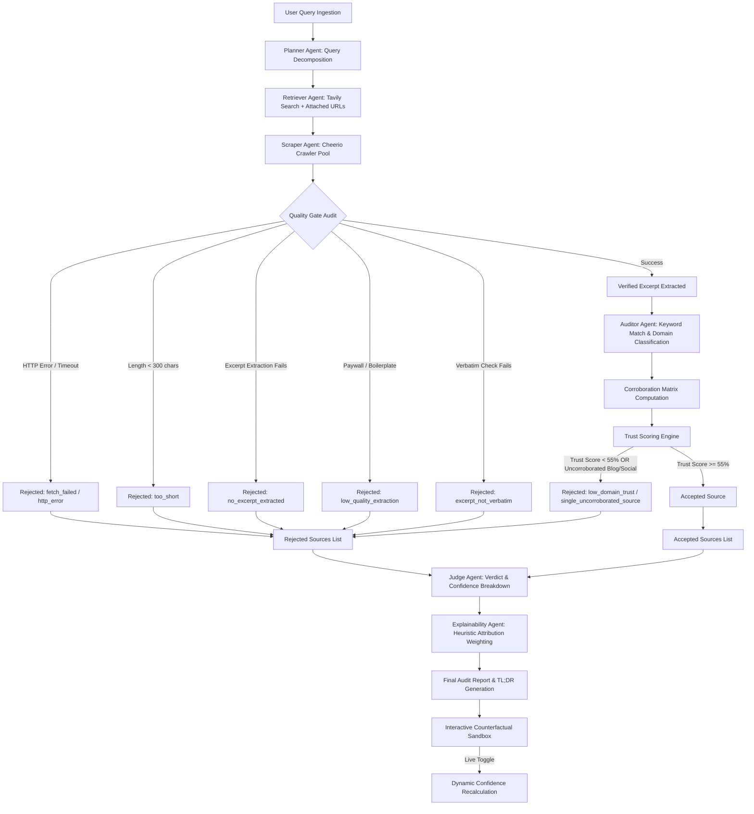

# EAIP — Explainable Autonomous Investigation Platform

A multi-agent AI research console that investigates a claim by actually crawling the live web, keeping a verbatim, clickable citation trail for every sentence it relies on, and refusing to render a verdict when it can't back one up with real evidence.

> **Design principle this project is built around:** nothing that looks like retrieved evidence, a fetched page, a credibility score, or a model attribution is ever shown unless it was actually computed or fetched in that run. If live retrieval fails, the app shows a distinct failure screen — it never quietly substitutes canned/demo content into a "real result" slot.

---

## Table of Contents

1. [What it does](#what-it-does)
2. [Architecture overview](#architecture-overview)
3. [Pipeline flow diagram](#pipeline-flow-diagram)
4. [Tech stack](#tech-stack)
5. [Project structure](#project-structure)
6. [Getting started](#getting-started)
7. [Environment variables](#environment-variables)
8. [Running the app](#running-the-app)
9. [Using the app](#using-the-app)
10. [Data model](#data-model)
11. [Live mode vs. Simulation/Sandbox mode](#live-mode-vs-simulationsandbox-mode)
12. [Important honesty notes (read this)](#important-honesty-notes-read-this)
13. [Troubleshooting](#troubleshooting)
14. [Known limitations / roadmap](#known-limitations--roadmap)

---

## What it does

You give EAIP a claim or question (e.g. *"Did Company X exaggerate its sustainability claims?"*), optionally attach files or URLs, and press **Run Audit**. The system:

1. Breaks the question into search queries that are generated **from your actual input text** (not a stored example).
2. Searches the live web and fetches individual pages (articles, filings, reports) — never search-results pages.
3. Extracts a verbatim excerpt from each page and scores/classifies the source (domain type, corroboration, keyword match).
4. Accepts or rejects every single candidate source using an explicit, inspectable rule-based function — nothing is silently dropped.
5. Produces a verdict, a confidence breakdown, alternative hypotheses that were considered and rejected, and a full forensic/decision trace you can replay.
6. Lets you click any citation to see the exact URL, timestamp, and the real text snippet that supports it. Lets you toggle sources off in a counterfactual sandbox to see how the verdict would change.

If live retrieval can't run (no API key, quota exceeded, network failure), the app shows an **explicit failure screen** — never a fake verdict.

---

## Architecture overview

Five real backend stages, each mapped to a distinct code path (not just a cosmetic label):

| Stage | Responsibility |
|---|---|
| **Planner** | Extracts entities/keywords from your literal input and generates search queries from them. |
| **Retriever** | Runs live web search (Tavily) + fetches individual pages for user-attached URLs, using a real HTTP scraper. |
| **Evidence Evaluator** | Runs the rule-based accept/reject scoring function (domain trust, corroboration count, keyword/claim match, excerpt quality). |
| **Judge** | Weighs accepted evidence into a verdict, and constructs/rejects alternative hypotheses. |
| **Explainer / Audit Logger** | Assembles the Source Ledger, decision trace, citation trail, and the exportable Verification Report. |

Every UI status update is meant to be driven by a real backend event (a fetch resolving, a source being scored) rather than a timer simulating progress.

---

## Pipeline flow diagram



---

## Tech stack

| Layer | Choice |
|---|---|
| Frontend | React + Vite, TypeScript |
| Backend | Node.js + Express (`server.ts`) |
| LLM | Gemini (Google AI Studio) |
| Web search | Tavily Search API |
| Page scraping | Node `fetch` + Cheerio (HTML → text parsing) |
| Explainability | Deterministic in-house heuristic (see honesty note below — **not** the Python `shap`/`lime` libraries) |
| Diagrams | Mermaid |
| Persistence | In-memory / JSON log per run (swap for Postgres for durability if you need history across restarts) |

---

## Project structure

```
.
├── server.ts                          # Express backend: /api/investigate, scraping, scoring
├── src/
│   ├── App.tsx                        # Main app shell, mode switch (Live vs Sandbox), routing
│   ├── types.ts                       # Shared TypeScript interfaces (FetchRecord, SourceEvaluation, etc.)
│   ├── demo_cases.ts                  # Static "View Sample" sandbox fixtures — never used by live runs
│   └── components/
│       ├── LangGraphViewer.tsx        # Live animated pipeline graph (left panel)
│       ├── ForensicLedger.tsx         # Live audit ledger (right panel)
│       ├── CitationTrailViewer.tsx    # Source Explorer / Proof Cards / citation click-through
│       ├── VerificationReport.tsx     # Final exportable audit report
│       ├── CounterfactualSandbox.tsx  # Toggle sources on/off, recompute verdict
│       ├── SimulationConsoleView.tsx  # Distinct screen shown only in sandbox / failure states
│       ├── DecisionGraphViewer.tsx    # Decision tree / hypothesis comparison
│       └── PipelineOverlay.tsx        # Agent swarm status board
├── package.json
├── metadata.json
└── README.md
```

*(Exact filenames may differ slightly depending on which build iteration you're running — use this as a map, not a literal manifest.)*

---

## Getting started

### Prerequisites

- **Node.js** 18+ and npm
- A **Gemini API key** (free tier available via [Google AI Studio](https://aistudio.google.com/))
- A **Tavily API key** (free tier available via [tavily.com](https://tavily.com/)) — used for live web search
- Internet access from the machine running the server (it makes real outbound HTTP requests)

### Install

```bash
git clone <your-repo-url>
cd <your-repo-folder>
npm install
```

---

## Environment variables

Create a `.env` file in the project root:

```bash
GEMINI_API_KEY=your_gemini_api_key_here
TAVILY_API_KEY=your_tavily_api_key_here
PORT=3000
```

| Variable | Required | Purpose |
|---|---|---|
| `GEMINI_API_KEY` | Yes, for live runs | Powers query decomposition, judge reasoning, and explanation generation |
| `TAVILY_API_KEY` | Yes, for live runs | Powers live web search (returns real result URLs to crawl) |
| `PORT` | No (defaults to 3000) | Express server port |

Without both keys, the backend cannot perform a live investigation. In that case, the app is expected to show an explicit **"Investigation Could Not Run"** screen — use the **"View Sample Investigation"** entry point on the landing page instead to explore the UI without live calls.

---

## Running the app

### Development mode (frontend + backend)

```bash
npm run dev
```

This typically starts:
- The Vite dev server for the frontend (default `http://localhost:5173`)
- The Express API server (default `http://localhost:3000`)

If your frontend can't reach the API (you see relative-path `404`s), confirm the frontend's API base URL matches the Express port — this project resolves this dynamically in `App.tsx`, but double-check if you're running on a non-default port such as `4173` or `5173` via `vite preview`.

### Production build

```bash
npm run build
npm start
```

This bundles the frontend into static assets and compiles the backend (e.g. into `dist/server.cjs`), then serves both from a single Node process.

### Quick sanity check

1. Open the app in your browser.
2. Click **"View Sample Investigation"** on the landing screen — this loads a fixture case entirely client-side, no API key required. Confirm the UI renders (verdict banner, source ledger, decision graph, counterfactual sandbox).
3. Add your API keys to `.env`, restart the server, then type a real question and click **Run Audit** to confirm a live crawl completes.

---

## Using the app

1. **Enter a claim or question** — e.g. *"Did [Company] overstate [claim] by [year]?"*
2. **(Optional) Attach files or URLs** — PDFs, images, or direct links get folded into the evidence pool alongside live search results.
3. **Choose a mode**:
   - **Live Agent** — real web search + real scraping + real Gemini reasoning (requires both API keys).
   - **Simulation** — instant, offline, clearly labeled as a sandbox; consumes no API quota.
4. **Watch the pipeline run** — the left panel animates the live agent graph (Planner → Retriever → Evidence Evaluator → Judge → Explainer); the right panel streams the Forensic Ledger as each stage completes.
5. **Inspect the verdict**:
   - Click any citation marker to open a **Proof Card**: the real URL, fetch timestamp, HTTP status, and the exact verbatim excerpt used.
   - Open the **Source Explorer** to see every source that was crawled, whether accepted or rejected, and the specific `reasonCode` for that decision.
   - Use the **Counterfactual Sandbox** to toggle sources off and watch the confidence/verdict recompute live.
   - Check **Alternative Hypotheses** to see what other conclusions were considered and why they were rejected.
6. **Export** — download the Verification Report, the `crawl_manifest.json`, and `citations.json` bundle for offline review or reproduction.

---

## Data model

```ts
interface FetchRecord {
  id: string;
  timestamp: string;                 // ISO 8601
  type: "search_query" | "page_fetch";
  query?: string;                    // for search_query records
  url?: string;                      // for page_fetch records
  httpStatus?: number;
  success: boolean;
  errorMessage?: string;
  rawExcerpt?: string;               // verbatim substring of the real fetched page text
  fullTextLength?: number;
  domain?: string;
  fetchedAt: string;
}

interface SourceEvaluation {
  fetchRecordId: string;
  url: string;
  domain: string;
  domainType: "gov" | "edu" | "news_wire" | "ngo" | "corporate" | "blog" | "social" | "other";
  publicationDate?: string;
  corroboratedByCount: number;
  claimTextMatch: boolean;           // checked programmatically, not asserted by the LLM
  decision: "accepted" | "rejected";
  reasonCode: string;                // e.g. "single_uncorroborated_source", "low_domain_trust", "low_quality_extraction"
  reasonText: string;                // generated from the structured fields above
}

interface DecisionTraceEvent {
  timestamp: string;
  stage: "planner" | "retriever" | "evidence_evaluator" | "judge" | "explainer";
  eventType: string;                 // e.g. "query_issued", "page_fetched", "source_rejected", "verdict_reached"
  detail: string;
  relatedFetchRecordId?: string;
}
```

### Rejection reason codes in use

| Code | Meaning |
|---|---|
| `fetch_failed` / `http_error` | Page could not be retrieved |
| `too_short` | Extracted text below minimum length threshold |
| `no_excerpt_extracted` | No usable sentence-level excerpt could be pulled |
| `low_quality_extraction` | Extracted text is dominated by cookie banners, login walls, or other boilerplate |
| `excerpt_not_verbatim` | Candidate excerpt failed the `pageText.includes(rawExcerpt)` check |
| `low_domain_trust` | Combined trust score fell below threshold |
| `single_uncorroborated_source` | Blog/social-only source with zero corroboration |
| `no_claim_match` | Fetched text doesn't actually contain language supporting the claim |

---

## Live mode vs. Simulation/Sandbox mode

These are **intentionally two separate code paths and two separate screens**:

| | Live Agent | Simulation / View Sample |
|---|---|---|
| Data source | Real Tavily search + real page fetches + real Gemini calls | Static fixture data in `demo_cases.ts` |
| Requires API keys | Yes | No |
| Screen | Full investigation console with live-updating panels | Distinct sandbox layout with a persistent "Sandbox / Simulation Active" banner |
| Verdict | Computed from actually-accepted evidence for *this* run | Pre-baked example content, clearly labeled |
| Failure behavior | Explicit "Investigation Could Not Run" screen with a specific reason and retry button | N/A — sandbox never fails |

The app is designed so a simulated result can never be mistaken for a live one — different layout, different banner, different color language, no shared visual slot with the live verdict banner.

---

## Important honesty notes (read this)

A few things worth being explicit about so nobody overstates what this system does when presenting or shipping it:

- **The "SHAP" panel is not the Python `shap` library.** It's a deterministic, hand-written additive-weighting heuristic (based on `domainType`, recency, corroboration count, etc.) implemented in TypeScript, labeled in the UI as a heuristic attribution model. If you want real SHAP values, you'd need to train an actual classifier (e.g. scikit-learn) on real features server-side and compute SHAP against that model — this repo does not currently do that.
- **LIME and Grad-CAM panels**, if present in your build, are similarly only legitimate if backed by a real trained classifier / vision model. If no such model is wired up, those components should be removed rather than left rendering invented numbers.
- **Citations only render if the exact detail (page number, named report, named figure) appears in the real fetched excerpt.** If the model wants to cite something more specific than what was actually retrieved, the correct behavior is to block that specific claim and log `unverifiable_specific_claim` — not to render it anyway.
- **Any cryptographic-looking hash or "compliance" language in the audit ledger should be a real computed hash of real content** (e.g. SHA-256 of the fetched page bytes) — not a hardcoded string. Similarly, avoid inventing institutional claims (e.g. a fictitious "compliance charter" or "validator ecosystem") anywhere in generated reports.
- **Every rejected candidate is logged, not dropped.** If your source counts don't add up (e.g. "0 accepted" next to a confident verdict with specific citations), that's a bug, not acceptable behavior — treat it as a P0 issue.

---

## Troubleshooting

**"Investigation Failed: Autonomous investigation endpoint failed."**
This means the live pipeline could not complete — most commonly because `GEMINI_API_KEY` and/or `TAVILY_API_KEY` are missing, invalid, or rate-limited. Check your `.env` file and server logs for the specific upstream error. Use **View Sample Investigation** to explore the UI in the meantime.

**Frontend gets 404s calling the API in preview mode.**
Confirm the API base URL used by the frontend matches the actual Express server port, especially if you're serving the built frontend via `vite preview` on `4173`/`5173` while the API runs on a different port. Set an explicit API base URL via an environment variable (e.g. `VITE_API_BASE_URL`) if your deployment splits frontend/backend across different origins.
 
**All my queries return suspiciously similar-looking results.**
This indicates the fixture/demo path is leaking into the live path. Search the codebase for hardcoded example strings (company names, mission IDs, sample hashes) outside of `demo_cases.ts` — none should exist in `server.ts` or the live request handlers.

**Excerpts look like cookie banners or "please log in" text.**
The quality gate (`low_quality_extraction`) should catch and reject these automatically. If they're slipping through, tighten the boilerplate-detection heuristic in the scraper.

---

## Known limitations / roadmap

- No persistent database wired in by default — investigation history resets between server restarts unless you add Postgres (or similar) for `FetchRecord` / `SourceEvaluation` / `DecisionTraceEvent` storage.
- Explainability panels are heuristic, not model-derived (see honesty notes above) — a genuine uplift here would be training a small real classifier on domain/recency/citation features and computing real SHAP values against it.
- Search/scrape coverage is limited by whatever free-tier rate limits apply to Tavily and Gemini.
- No authentication/user accounts — this is a single-session research console, not a multi-tenant product.
